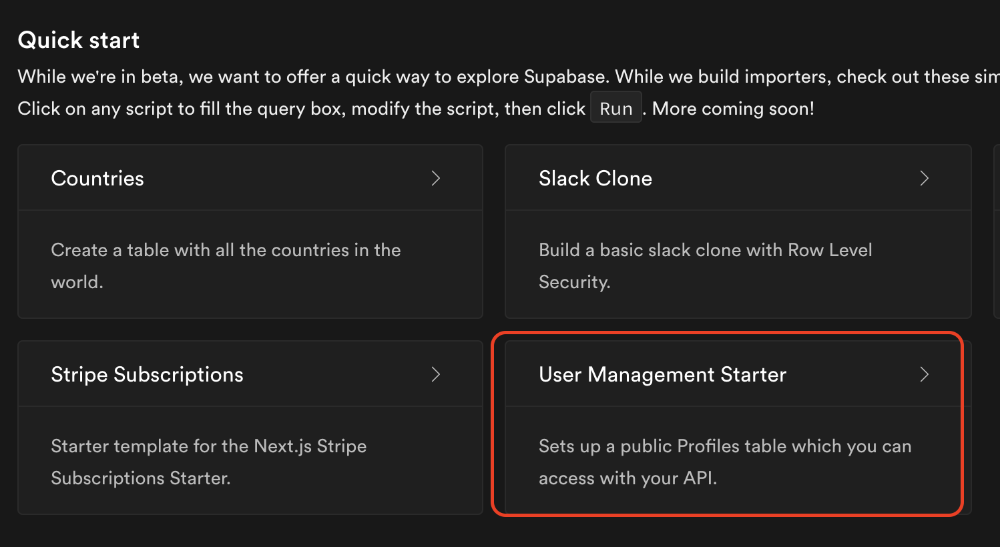

# Flutter で Supabase に入門する

- Supabaseでプロジェクト作成
    - Supabaseにログインし "New Project" で Tokyo リージョンにプロジェクトを作成する
        - [app.supabase](https://app.supabase.io/)

- [supabase-flutter](https://github.com/supabase/supabase-flutter)
    - supabase-dartに依存あり
- [supabase-dart](https://github.com/supabase/supabase-dart)

## Flutterプロジェクトにとりあえず導入する

- `flutter create myapp` する。　リリースしないので org などのオプションは無視
- `flutter pub add supabase_flutter` でパッケージを入れる
- 初期化する（以下の通り)

```dart
import 'package:supabase_flutter/supabase_flutter.dart';

void main() {
  WidgetsFlutterBinding.ensureInitialized();

  Supabase.initialize(
    url: SUPABASE_URL,
    anonKey: SUPABASE_ANNON_KEY,
    authCallbackUrlHostname: 'login-callback', // optional
    debug: true // optional
  );

  runApp(MyApp());
}
```
- url, anonKey は supabase のプロジェクトのページから取ってくる。RLS (RowLevelSecurity) をちゃんとやっていれば公開しても別に良いって書いている。
- authCallbackUrlHostname は Magic Link などで認証した時に返ってくるためのもの。 org 設定やってたら使える。
- debug は `flutter run --debug` でデフォルト true なので特に設定しなくてよさそう


##　Auth の準備

- Settings の AuthSettings でメール認証や Social 認証の有効化が必要
  - email の verification の場合のリダイレクト先やメール文章なども

### Auth結果のユーザー情報を保存したい場合

- Auth結果のテーブルを作る
  - User Management Starter の SQL 使うと楽なので使う
    
  - スターターのクエリ文は実行前に閲覧・編集できるので過不足あればちょちょっと変えればOK。デフォルトは以下のテーブル (プラス、ルールがもろもろ)
    ```sql
    create table profiles (
      id uuid references auth.users not null,
      updated_at timestamp with time zone,
      username text unique,
      avatar_url text,
      website text,

      primary key (id),
      unique(username),
      constraint username_length check (char_length(username) >= 3)
    );
    ```
  - テーブル生成が完了すると、Tablesのページに profilesが増えているのでこれで準備OK
- DeepLink を使いたいなら、Androidは AndroidManifest, iOS は info.plist にいろいろ追加が必要。詳細は [DeepLinkの設定](https://supabase.io/docs/guides/with-flutter#setup-deep-links)を参照。

## Auth - Email & Password 

SignUpはこれでOK

```dart
void supabaseSignUp(String email, String password) async {
  final res = await Supabase.instance.client.auth.signUp(email, password);
  if (res.error != null) {
    print('error, signup');
  } else {
    print('success, signup');
  }
}
```
ただし、 email がすでに使われています〜とか、パスワード短すぎ〜とかがわからない。手がかりは res.error.message のString文のみ。これは厳しい。

- email-already-in-use
- invalid-email
- week-password

これだけはなんとか分離したい

> Issue を立てました [Error response for Sign-up with email & password should include error type (or code) to handle the reason of error, in client side. #217](https://github.com/supabase/gotrue/issues/217)

To be continued....